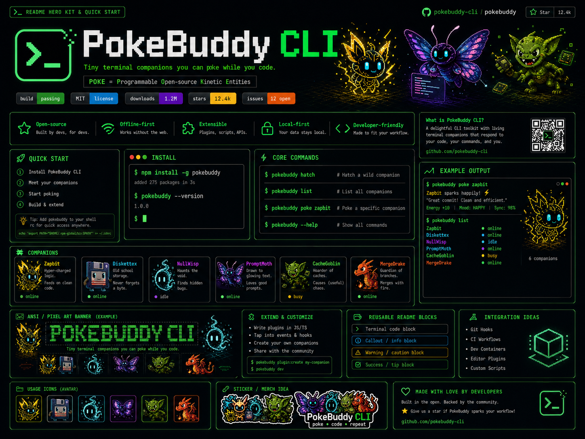
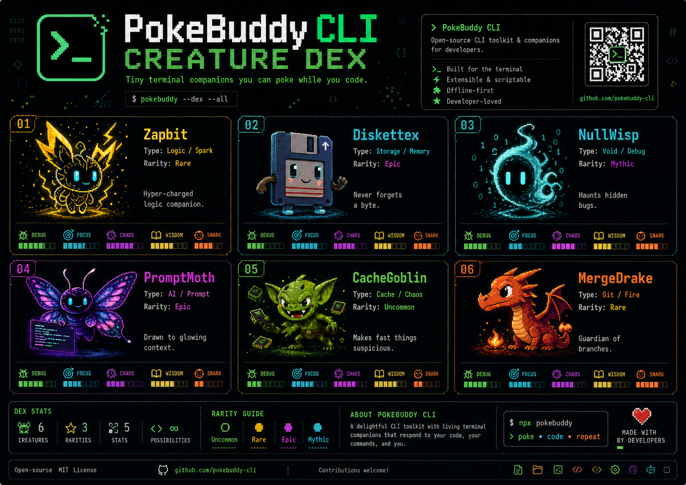

<p align="center">
  
</p>

# PokeBuddy CLI

> Tiny terminal companions you can poke while you code.

**POKE = Programmable Open-source Kinetic Entities**

PokeBuddy CLI is a local-first, open-source terminal companion system for developers. Hatch tiny programmable companions, poke them during coding sessions, let them react to commits, tests, logs, prompts, builds and the beautiful chaos of shipping software.

It is part CLI toy, part dev mascot, part collectible terminal ritual. A small spark of delight living between your prompt and your next commit.

<p align="center">
  
  
  
  
</p>

---

## Preview

<p align="center">
  
</p>

## Why?

Most developer tools are useful. Few are memorable.

PokeBuddy adds a tiny living layer to the terminal: a companion that reacts, remembers, grows and makes your workflow feel a little more alive.

```bash
$ pokebuddy hatch
$ pokebuddy list
$ pokebuddy poke zapbit
$ pokebuddy status
```

---

## Features

- **Terminal native**: runs directly in your shell.
- **Offline-first**: no account, no server, no tracking.
- **Local state**: companion data lives in `~/.pokebuddy/state.json`.
- **Collectible companions**: six launch companions with types, rarity, stats and personality.
- **Zero runtime dependencies**: built with Node.js standard library.
- **Extensible foundation**: designed for future plugins, Git hooks and editor integrations.

---

## Install

### From source

```bash
git clone https://github.com/pokebuddy-cli/pokebuddy.git
cd pokebuddy
npm install
npm link
pokebuddy hatch
```

### Local development

```bash
npm test
npm run lint
node ./bin/pokebuddy.js hatch
```

---

## Core commands

| Command | Description |
|---|---|
| `pokebuddy hatch` | Hatch your first companion. |
| `pokebuddy hatch --force` | Discover another companion. |
| `pokebuddy hatch --all` | Unlock all launch companions locally. |
| `pokebuddy list` | List discovered companions. |
| `pokebuddy dex` | Show all known companions. |
| `pokebuddy show [name]` | Show a companion card. |
| `pokebuddy poke [name]` | Interact with a companion. |
| `pokebuddy feed [name] [thing]` | Feed context, cache or any offering. |
| `pokebuddy status` | Show local state and active companion. |
| `pokebuddy rename <name> <alias>` | Give a companion a custom alias. |
| `pokebuddy legal` | Print legal notice. |
| `pokebuddy reset --yes` | Reset local state. |

---

## Launch companions

| Companion | Type | Rarity | Personality |
|---|---|---|---|
| **Zapbit** | Logic / Spark | Rare | Hyper-charged logic companion. |
| **Diskettex** | Storage / Memory | Epic | Never forgets a byte. |
| **NullWisp** | Void / Debug | Mythic | Haunts hidden bugs. |
| **PromptMoth** | AI / Prompt | Epic | Drawn to glowing context. |
| **CacheGoblin** | Cache / Chaos | Uncommon | Makes fast things suspicious. |
| **MergeDrake** | Git / Fire | Rare | Guardian of branches. |

---

## Example output

```text
$ pokebuddy poke zapbit
Zapbit sparks happily. Great commit. Clean and efficient.

Energy: 60%   Mood: happy   XP: 12   Level: 1
```

```text
$ pokebuddy list
 ● Zapbit         ⚡  happy        lv.1  xp.12
   Diskettex      💾  idle         lv.1  xp.0
```

---

## Roadmap

- [x] Launch companions
- [x] Local hatch/list/poke/status loop
- [x] ASCII/ANSI-inspired terminal cards
- [ ] Git hook reactions
- [ ] `pokebuddy watch`
- [ ] Plugin API
- [ ] Companion creation kit
- [ ] Animated terminal states
- [ ] Exportable companion cards
- [ ] VS Code / Cursor extension experiments

See [`ROADMAP.md`](ROADMAP.md) for the full plan.

---

## Brand assets

| Asset | Path |
|---|---|
| Brand identity guide | `assets/brand/pokebuddy_cli_brand_identity_guide.png` |
| Companion guide | `assets/brand/pokebuddy_cli_companion_guide_poster.png` |
| README hero kit | `assets/brand/pokebuddy_cli_terminal_companions_in_neon_style.png` |
| Launch poster & merch | `assets/brand/pokebuddy_cli_launch_poster_and_merch.png` |

---

## Legal notice

PokeBuddy CLI is an independent open-source project.

PokeBuddy CLI is not affiliated with, endorsed by, sponsored by, authorized by, or officially connected with Nintendo, The Pokémon Company, Game Freak, Creatures Inc., Anthropic, or Claude Code.

“POKE” in PokeBuddy means **Programmable Open-source Kinetic Entities** and is used as part of the project’s original identity around interactive terminal companions.

All companions, names, ASCII art, lore, code and visual concepts in this repository are original to this project unless otherwise stated.

See [`LEGAL.md`](LEGAL.md) for the full notice.

---

## Contributing

Contributions are welcome. Please read:

- [`CONTRIBUTING.md`](CONTRIBUTING.md)
- [`docs/CREATURE_GUIDELINES.md`](docs/CREATURE_GUIDELINES.md)
- [`docs/NAMING_GUIDELINES.md`](docs/NAMING_GUIDELINES.md)
- [`LEGAL.md`](LEGAL.md)

When in doubt: make it original, make it weird, make it developer-flavored.

---

## License

MIT. See [`LICENSE`](LICENSE).

Made with a glowing cursor and too much affection for terminals.
